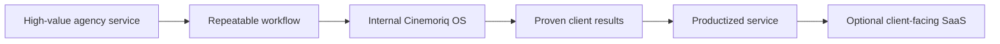
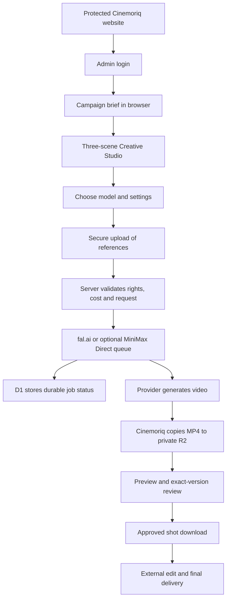

# Cinemoriq Master Product, Video Workflow & Roadmap

> **Simple Hinglish operating guide**  
> **Last verified:** 25 August 2026  
> **Audience:** Cinemoriq founder/operator, future team members, agency partners, and selected clients

## Status legend

- ✅ **Live:** feature abhi application mein real kaam karta hai.
- 🟡 **Partial:** usable hai, lekin important limitation ya manual step hai.
- 🔵 **Planned:** future roadmap ka part hai; abhi live feature nahi hai.

> **Most important truth:** Cinemoriq khud Veo, Kling, Seedance ya MiniMax jaisa video model nahi hai. Cinemoriq ek **private AI creative production operating system** hai jo business brief, scenes, multiple video models, paid generation jobs, storage aur human approval ko ek controlled workflow mein jodta hai.

---

## 1. Cinemoriq ek line mein kya hai?

**Cinemoriq ek private creative command center hai jahan ek business goal ko campaign brief, storyboard, AI-generated video shots aur approved deliverables mein convert kiya jata hai.**

Simple example:

> Client bolta hai: “Hamari new industrial robot ko US market mein launch karna hai.”  
> Cinemoriq us goal ko structured brief mein convert karta hai, three-scene direction ready karta hai, har shot ke liye right AI model select karne deta hai, output securely save karta hai, aur final human approval record karta hai.

Current production chain:

```text
Business goal
    → Campaign brief
    → 3-scene storyboard
    → Model + settings selection
    → Paid AI generation
    → Private video storage
    → Human review
    → Approved shot download
    → External final editing/delivery
```

---

## 2. Ye product kyu banaya gaya hai?

### 2.1 Real market problem

AI video production normally fragmented hoti hai:

- Brief Google Docs mein hota hai.
- Assets Drive folders mein scattered hote hain.
- Veo, Kling, Seedance aur MiniMax ke alag interfaces hote hain.
- Har model ke duration, audio, aspect ratio aur reference rules alag hote hain.
- Prompts WhatsApp ya notes mein kho jate hain.
- Kaunsa version client ne approve kiya, iska proper record nahi hota.
- API key browser mein expose hone ka risk hota hai.
- Ek click se paid generation duplicate ho sakti hai.
- Final output aur source rights ka audit trail weak hota hai.

Ek one-person agency mein founder ko strategist, salesperson, director, prompt designer, producer, reviewer aur project manager sab banna padta hai. Agar system na ho, growth ke saath chaos bhi grow karta hai.

### 2.2 Cinemoriq ka solution

Cinemoriq ka purpose “AI se random pretty videos banana” nahi hai. Iska purpose hai:

1. **Business intent ko production-ready direction mein convert karna.**
2. **Har scene ke liye right model aur right settings choose karna.**
3. **Paid generations ko controlled, recoverable aur traceable banana.**
4. **Brand, rights aur human review ko workflow ka mandatory part banana.**
5. **Founder ki repeatable production IP create karna.**
6. **Future mein agency workflow ko client-facing software/SaaS mein productize karna.**

### 2.3 Client ko real benefit kya milega?

| Client problem | Cinemoriq-led solution | Expected business value |
|---|---|---|
| Complex product ko explain karna difficult | Cinematic product visualization | Product ko fast aur memorable tarike se samjhana |
| Traditional shoot expensive ya slow | AI previsualization and selected AI production | Faster concept testing and lower iteration cost |
| Multiple formats chahiye | Model-aware horizontal/vertical/square variants | Same campaign ka wider channel coverage |
| Agency process unclear | Structured brief, versions and approvals | Greater trust and fewer approval misunderstandings |
| Vendor tools scattered | One operating workflow | Faster execution and clearer accountability |
| Brand/rights risk | Mandatory rights and human-review confirmations | Safer commercial use |

**Important:** Cinemoriq attention create kar sakta hai, production speed improve kar sakta hai aur approval friction reduce kar sakta hai. Lekin sales ya ROI automatically guarantee nahi karta. Real ROI ke liye offer, distribution, landing page, lead handling aur sales follow-up bhi strong hone chahiye.

---

## 3. Cinemoriq ki three identities

Confusion avoid karne ke liye Cinemoriq ko three layers mein samjho:

### Layer A — Cinemoriq brand/company

Ye market-facing premium AI company identity hai.

Positioning:

> **We create demand with cinematic AI—and capture it with custom software.**

Long version:

> We help industrial companies launch complex products through cinematic AI content and convert that attention into qualified enquiries using custom software and automation.

### Layer B — Cinemoriq service business

Agency clients ko two connected capabilities sell karegi:

1. **Cinematic demand creation:** AI films, launch videos, product visuals, localized variants.
2. **Intelligent operations:** lead capture, qualification, RFQ routing, CRM automation and dashboards.

Current app primarily first capability—cinematic production—ko support karta hai. Lead capture, CRM/RFQ automation aur real campaign analytics abhi app mein live nahi hain.

### Layer C — Cinemoriq OS/product

Ye internal software hai jo service delivery ko standardize karta hai. Future mein isi repeatable operating system ko multi-user client portal ya white-label SaaS banaya ja sakta hai.

Best sequence:



**Why services first?** Real clients se language, pain, approvals, economics aur edge cases milte hain. Unproven workflow ko pehle SaaS banana expensive guessing hota hai.

### Business/operating model

Cinemoriq ka recommended commercial model:

```text
Paid Opportunity Sprint
    → Defined client project
    → Repeatable campaign/production system
    → Monthly retainer or white-label agency partnership
    → Repeated proof ke baad optional SaaS
```

- **Founder:** client strategy, creative direction, model decision, commercial judgment and final QA own karta hai.
- **Cinemoriq OS:** intake, scenes, model controls, jobs, storage and approvals ko standardize karta hai.
- **AI models:** production engines hain; inka usage fee internal cost of goods sold (COGS) hai, client price nahi.
- **Client:** business context, approvals, rights-cleared assets, claims and measurable outcome provide karta hai.
- **Future team/partners:** editing, compositing, sound, specialist development and account delivery scale kar sakte hain.

Commercial ladder ka purpose cheap render reseller banna nahi hai. Goal hai strategy + cinematic production + controlled delivery + future automation ko high-value outcome ke form mein sell karna. SaaS tabhi build/sell karo jab repeated client work prove kare ki same workflow multiple customers genuinely use karenge.

---

## 4. Iska primary user aur target customer kaun hai?

### Current direct user

✅ Abhi Cinemoriq ek **single-administrator founder workspace** hai. Founder/creative director isko privately operate karta hai. Ye abhi client self-service platform ya multi-team SaaS nahi hai.

### Primary target customer

- US/UK industrial equipment companies
- Machinery manufacturers
- Robotics and automation companies
- Advanced manufacturing brands
- Companies jinka physical product expensive hai aur launch/explanation difficult hai
- Companies with trade-show, dealer/distributor or product-launch needs

### Secondary target customer/channel

- US/UK/UAE creative agencies
- Production houses
- Marketing agencies
- Web/branding agencies jinko white-label AI video partner chahiye

### Future/opportunistic segments

- Premium automotive
- Real estate and hospitality
- Luxury products
- Architecture and destination marketing
- B2B software with visually complex stories

---

## 5. Best use cases

### 5.1 Industrial product launch film

Machine ko dramatic world mein establish karo, core mechanism show karo, phir CTA/end card ke saath close karo.

### 5.2 Product image animation

Approved product render/photo ko start frame banakar controlled motion, camera orbit, light sweep ya environment animation create karo.

### 5.3 First-to-last-frame transition

Client-approved opening aur closing frames ke beech smooth cinematic movement generate karo. Product identity control ke liye useful.

### 5.4 Reference-driven commercial shot

Multiple images, motion references, video references ya audio cues se output direction control karo—sirf supported models/modes mein.

### 5.5 Campaign variants

Same creative idea ke 16:9 website/YouTube, 9:16 Reels/Shorts aur 1:1 social variants generate karo, model support ke according.

### 5.6 White-label agency production

Foreign agency brief deti hai; Cinemoriq behind the scenes structured production, versioning aur approvals manage karta hai.

### 5.7 Previsualization

Expensive live shoot se pehle concept, camera language, lighting aur transitions test karo. AI output final asset na bhi ho, creative decision faster ho jata hai.

### Abhi kis kaam ke liye suitable nahi hai?

- One-click full-length perfect film
- Unauthorized celebrity/CEO/real-person deepfake
- Copyrighted material ka unauthorized imitation
- Guaranteed viral content or guaranteed sales
- Automatic ad publishing/media buying
- Complete CRM/RFQ automation inside the current app
- Multi-user client accounts
- Full nonlinear editing, transitions, captions and master export inside Cinemoriq

---

## 6. Aaj application mein kya real hai aur kya planned hai?

| Capability | Status | Reality |
|---|---:|---|
| Admin email/password login | ✅ | One protected administrator account, revocable server session |
| Command Center | 🟡 | Campaign start point; campaign, pending-approval and agent-activity cards sample/local preview hain, live D1 analytics nahi |
| Seven-step campaign intake | ✅ | Intent, audience, product, brand, channels, creative direction, safeguards |
| Campaign brief record | 🟡 | Validated structured record; browser-local, not an LLM strategy agent |
| Campaign Workspace agents | 🟡 | Deterministic workflow preview; no external agent/model runs here yet |
| Three-scene storyboard | ✅ | Establishing World, Product Reveal, Signature Detail |
| Real AI video generation | ✅ | fal.ai models and optional MiniMax Direct |
| Secure reference upload | ✅ | Signed upload; server key browser mein expose nahi hoti |
| Paid-cost confirmation | ✅ | Preflight estimate and explicit authorization |
| Durable generation jobs | ✅ | Job status/cost/provider data D1 database mein |
| Private generated video storage | ✅ | Completed media private R2 storage mein |
| Version review | ✅ | In review, approved, or changes requested |
| Individual shot download | ✅ | Authenticated video playback/download |
| Add/delete/reorder scenes | 🔵 | Add Scene abhi disabled hai |
| Timeline editing | 🟡 | Play/seek/select/zoom; trim/reorder/transitions/audio mix nahi |
| Complete film export | 🔵 | Approved shots external editor mein assemble karne honge |
| Brand Vault | 🔵 | Navigation preview only |
| Real agent workforce | 🔵 | Navigation/workspace concept only |
| Analytics | 🔵 | Real campaign-performance engine abhi live nahi |
| Publishing and media buying | 🔵 | Not implemented |
| Client/team accounts | 🔵 | Current product single-admin hai |
| CRM/RFQ automation | 🔵 | Larger agency vision ka part; current app ka nahi |

---

## 7. Current technical flow—simple language mein



### Data kaha save hota hai?

- **Browser/local storage:** campaign draft, generated campaign record, editable scene direction, timeline selection.
- **D1 database:** real generation jobs, provider IDs, cost/status, login/session records, provider-version review state.
- **Private R2 storage:** successfully generated MP4 output.

**Hard truth:** Browser data different device/browser par automatically sync nahi hota. Paid jobs aur generated media durable hain, lekin editable campaign context abhi cloud-synced project database nahi hai. Current UI job recovery browser-local campaign ID se scoped hai; local storage clear ya new browser use karne par backend job remain kar sakta hai, lekin global job library na hone ki wajah se UI mein uski discoverability lose ho sakti hai.

---

## 8. “AI video model” ka simple meaning

AI video model ek specialized engine hai jo text, image, video ya audio references ko moving video mein convert karta hai. Har model ka apna strength aur contract hota hai.

Analogy:

- **Cinemoriq** = film studio + production manager + approval system
- **Veo/Kling/Seedance/MiniMax** = different specialist camera/animation crews
- **fal.ai** = single gateway jiske through multiple crews ko job bheji jati hai
- **FAL_KEY** = secure account key used by Cinemoriq server
- **Prompt** = director ka written instruction
- **Reference asset** = approved visual/audio example
- **Generation job** = provider ko diya gaya paid render task

### One FAL key approach kyu best hai?

Veo, Kling, Seedance aur MiniMax H3 ke liye current architecture ek `FAL_KEY` use karta hai. Isse:

- Multiple provider secrets manage nahi karne padte.
- Billing/queue integration simpler hoti hai.
- Same secure job and storage pipeline reuse hota hai.
- Model switch UI se hota hai; key client/browser tak nahi jati.

MiniMax Hailuo 02 Direct ek optional exception hai aur separate `MINIMAX_API_KEY` maangta hai. Consumer Hailuo website ke welcome/free credits API rendering ke liye usable nahi hain.

---

## 9. Model selection guide

> Model specifications aur prices fast change hote hain. Neeche ka data Cinemoriq code aur official provider pages ke 25 August 2026 snapshot par based hai. **Paid job authorize karne se pehle current provider page/checkout ko final authority mano.**

### 9.1 Current model matrix

| Model | Best use | Modes currently integrated | Duration | Resolution shown in UI | Audio | References |
|---|---|---|---|---|---|---|
| **Veo 3.1** via fal.ai | Premium hero shots, dialogue, product storytelling | Text, image, first+last, reference | 4/6/8 sec | 720p, 1080p, 4K | Optional native audio | Reference mode: up to 3 images |
| **Kling 3 Standard** via fal.ai | Machinery, action, strong camera movement | Text, image, first+last | 3–15 sec | Standard/up to 1080p | Optional audio | Start/end frames; no reference mode in current integration |
| **Seedance 2.0** via fal.ai | Longer/multishot direction, multimodal control | Text, image, first+last, reference | Auto or 4–15 sec | 480p, 720p, 1080p, 4K shown | Optional synchronized audio | Up to 9 images, 3 videos, 3 audio; max 12 total |
| **MiniMax H3** via fal.ai | Longer audiovisual shots, reference-heavy generation | Text, image, first+last, reference | 5–15 sec | 480P, 768P, 2K, 4K shown | Native stereo required | Up to 9 images, 3 videos, 3 audio; max 12 total |
| **Hailuo 02 Direct** | Legacy direct MiniMax workflow and camera commands | Text, image, first+last | 6/10 sec | 512P/768P/1080P mode-dependent | No native audio | Start/end frames |

### 9.2 Fast decision rule

Use this practical selection logic:

```text
Premium dialogue / cinematic hero visual? → Veo 3.1
Machine movement / action / dynamic camera? → Kling 3 Standard
Many image-video-audio references? → Seedance 2.0 or MiniMax H3
Native stereo + longer 5–15 second shot? → MiniMax H3
Direct MiniMax legacy requirement? → Hailuo 02 Direct
Unsure? → Same 5–6 second brief ko 2 models par low-cost test karo.
```

### 9.3 Model-by-model practical guidance

#### Veo 3.1

Best for:

- High-end hero visuals
- Cinematic product storytelling
- Dialogue or synchronized audio experiments
- Premium lighting and believable camera language

Official fal.ai snapshot lists 720p/1080p/4K, 16:9/9:16, optional audio and up to 8 seconds. Standard pricing varies by resolution/audio—roughly `$0.20–$0.60 per second` in the current integrated catalog. Veo output may include invisible SynthID watermarking.

Use when quality matters more than lowest test cost.

#### Kling 3 Standard

Best for:

- Heavy machinery motion
- Vehicle/action shots
- Camera pushes, crane movement, tracking shots
- Strong physical movement

Current Standard integration exposes up to 1080p, 3–15 seconds and optional audio. Current catalog estimate is approximately `$0.084/sec` without audio and `$0.126/sec` with audio. Separate 4K endpoints exist but are not integrated in the current UI.

#### Seedance 2.0

Best for:

- Multimodal references
- Longer shots
- Image, video and audio-guided direction
- Multi-element/multishot concepts

Reference mode can accept up to 9 images, 3 videos and 3 audio files, with 12 total references. Provider aggregate rules also matter: combined video duration/size and combined audio duration can cause a provider rejection even if each file individually passes Cinemoriq's current UI checks.

**Current correctness warning:** Seedance reference pricing can depend on input-video duration plus output duration. Cinemoriq's estimate may differ materially from final provider billing. Provider checkout is authoritative.

#### MiniMax H3

Best for:

- 5–15 second audiovisual shots
- Native stereo sound
- Reference-rich product direction
- Longer standalone scene experiments

Audio is required in the current integration. Reference limits are similar to Seedance: up to 9 images, 3 videos, 3 audio files and 12 total. Current endpoint catalog estimates by resolution, but verify the live endpoint price before a high-resolution paid run.

#### MiniMax Hailuo 02 Direct

Use only when:

- A direct MiniMax API account is deliberately required.
- Hailuo 02 camera commands are specifically useful.
- Separate `MINIMAX_API_KEY` and API balance are configured.

This is not covered by the single fal key. It has no native audio in current integration, and direct-provider cancellation is not supported.

### 9.4 Cost examples—planning only

Approximate examples using the current integrated catalog:

| Test shot | Approximate generation estimate |
|---|---:|
| Veo, 8 sec, 1080p, no audio | about `$1.60` |
| Veo, 8 sec, 1080p, audio | about `$3.20` |
| Kling Standard, 10 sec, no audio | about `$0.84` |
| Kling Standard, 10 sec, audio | about `$1.26` |

Seedance/H3 reference pricing is more configuration-dependent, especially when input video is used. Cinemoriq shows an estimate and asks for explicit authorization, but it cannot guarantee that fal's final invoice will equal the estimate.

### 9.5 Output ke saath kya metadata milta hai?

Successful provider job ke saath Cinemoriq durable record mein ye information rakh sakta hai:

- Cinemoriq job ID and provider request ID
- Campaign, scene and exact version ID
- Selected model/mode/configuration
- Queue/processing/success/failure state
- Requested duration and audio configuration
- Provider output URL while available
- Private R2 media key, MIME type and file size
- Width/height when provider supplies it
- Seed when provider supplies it
- Expanded prompt for supported H3 output
- Review state: in-review, approved or changes-requested
- Error/cancellation information

Current UI provider, duration, file size and audio jaise selected fields show karta hai. Seed, expanded prompt, actual probed duration/resolution and complete cost ledger ko future UI mein clearer banana chahiye. Requested metadata ko actual media-probed fact assume mat karo jab tak file probe implement na ho.

### 9.6 Current integrations ki boundaries

- Veo Fast variants and extend-video current UI mein integrated nahi hain.
- Kling separate 4K, structured multi-prompt, element/voice and motion-control features current integration mein incomplete hain.
- Seedance provider par newer versions appear ho sakte hain; Cinemoriq intentionally `2.0` endpoint label use karta hai.
- H3 ka longer official prompt capacity current Cinemoriq prompt-length limit se fully use nahi hota.
- Hailuo 02 older direct integration hai; newer MiniMax generations available ho sakti hain.

Product screen par feature visible na ho to official model capability ko automatically “Cinemoriq-supported” mat mano.

---

## 10. Four creation modes—kab aur kaise use karein?

| Mode | Required input | Best use | Control level |
|---|---|---|---|
| **Text to Video** | Prompt | Fast ideation, environments, generic concepts | Lowest identity/product consistency |
| **Image to Video** | Start image + prompt | Approved product render ko animate karna | Better visual consistency |
| **First + Last Frame** | Opening and closing images + prompt | Controlled transition/end pose | Strong start/end control |
| **Reference to Video** | Model-supported image/video/audio references | Brand, subject, motion or sound direction | Highest inputs, most rule complexity |

### 10.1 Text-to-video workflow

1. One clear shot define karo—not a complete film.
2. Subject + action + environment + camera + light + mood + exclusions likho.
3. Model select karo.
4. Pehle 5–6 sec aur moderate resolution se test karo.
5. Best motion milne ke baad duration/resolution increase karo.
6. Product/logo accuracy manually review karo.

### 10.2 Image-to-video workflow

1. Clean, high-quality start image prepare karo.
2. Product proportions, text and logo inspect karo.
3. Upload image; file fully upload hone do.
4. Prompt mein image ko dobara invent mat karao—movement describe karo.
5. Camera motion, subject motion aur “preserve design/proportions” clearly state karo.
6. Low-cost test, then final-quality render.

### 10.3 First + last frame workflow

1. Opening aur closing frames same aspect ratio mein prepare karo.
2. Dono frames mein impossible geometry jump avoid karo.
3. Start and end frame upload karo.
4. Prompt mein transition path describe karo.
5. Medium motion se test karo; overly complex transformation reduce karo.
6. First/last frame fidelity and middle-frame artifacts check karo.

### 10.4 Reference-to-video workflow

1. Har reference ko role do: subject, environment, motion, camera, sound.
2. Sirf relevant references use karo; more references always better nahi hote.
3. Provider count + aggregate duration/size limits check karo.
4. Prompt mein references ka intended use explain karo.
5. Cinemoriq reference ordinal tags automatically prompt mein insert nahi karta. Seedance prompt mein supported syntax jaise `@Image1`, `@Video1`, `@Audio1` explicitly use karo; H3 ke liye current endpoint documentation/reference order follow karo.
6. Cost estimate carefully verify karo, especially input video ke saath.
7. Identity, product details, audio and unwanted copying inspect karo.

---

## 11. Video create karne se pehle one-time setup

### Step 1 — Access

1. Protected Cinemoriq URL open karo.
2. Administrator email/password se login karo.
3. Credentials kisi client ya unknown person ke saath share mat karo.

### Step 2 — Provider and storage health

**Settings** page open karke check karo:

- fal.ai key detected
- MiniMax Direct sirf Hailuo 02 use karna ho tab required

Current Settings UI provider-key status show karta hai; D1/R2 ke separate health indicators wahan visible nahi hain. Studio generation eligibility storage ko internally check karti hai. Settings browser mein secret accept/store nahi karta—secrets server environment mein configured hote hain.

### Step 3 — Provider balance

- fal.ai account mein sufficient credits/billing confirm karo.
- Small test budget set karo.
- First session mein expensive 4K generations se start mat karo.

### Step 4 — Assets folder

Har client/project ke liye ye folders rakho:

```text
01_Brief
02_Brand
03_Product_Images
04_References
05_Audio
06_Generated_Shots
07_Approved
08_Edit_Project
09_Final_Delivery
10_Licenses_and_Approvals
```

Current upload rules:

| Asset | Accepted formats | Current per-file limit | Extra rule |
|---|---|---:|---|
| Image | JPEG, PNG, WebP | Usually 8 MB; Seedance image up to 30 MB | Correct aspect and clean source preferred |
| Video reference | MP4, MOV | 50 MB per current uploader | Readable media, normally 2–15 sec |
| Audio reference | MP3, WAV | 15 MB | Readable media, normally 2–15 sec |

fal input-upload URL approximately 24 hours ka temporary lifetime rakhta hai, isliye upload ke baad expiry se pehle generation submit karo. Seedance ka 50 MB video-reference rule combined/aggregate total par apply ho sakta hai, jabki current Cinemoriq validation per-file size plus count check karti hai; multiple references ka total manually verify karo. Completed provider output ko Cinemoriq private R2 storage mein copy karta hai; temporary upload URL ko permanent client archive mat samjho.

### Step 5 — Rights confirmation

Confirm karo:

- Assets use karne ka right hai.
- Claims client ne approve kiye hain.
- Real person/identity ke liye permission hai.
- Protected characters/logos/material unauthorized use nahi ho raha.
- Har output human review se pass hoga.

---

## 12. Cinemoriq app mein exact step-by-step video workflow

### Phase A — Campaign create karo

1. **Command Center** open karo.
2. **Create a campaign** select karo.
3. Brief modal mein **Create brief** click karo.
4. Seven stages complete karo:

   1. Intent
   2. Audience
   3. Product
   4. Brand
   5. Channels
   6. Creative Direction
   7. Generate + safeguards

5. Final rights, identity and human-review confirmations check karo.
6. **Generate Campaign Brief** click karo.

> Yahan “Generate” ka matlab validated campaign record banana hai. Is stage par paid AI film render nahi hoti.

### Phase B — Campaign Workspace review karo

1. Campaign name aur brief review karo.
2. Concept preview/log ko production plan samjho—not a running agent system.
3. Agar brief ready hai, **Open Creative Studio** click karo.
4. Campaign paused hai to generation se pehle resume karo.

### Phase C — Scene direct karo

Current storyboard mein three default scenes hain:

1. **Establishing World** — brand/product environment establish karta hai.
2. **Product Reveal** — hero reveal/action dikhata hai.
3. **Signature Detail** — close detail/proof/finish shot.

Har scene ke liye:

1. Left rail/timeline se scene select karo.
2. AI Director controls open karo.
3. Scene prompt edit karo.
4. Visual style choose karo.
5. Lens choose karo (14–200mm range).
6. Lighting direction set karo.
7. Correct model select karo.
8. Creation mode select karo.
9. Duration set karo.
10. Resolution set karo.
11. Aspect ratio set karo.
12. Audio on/off set karo—model rules ke according.
13. Start/end/reference assets upload karo.
14. Advanced settings jaise negative prompt, seed, shot type, bitrate ya prompt expansion set karo, jab available hon.

### Phase D — Validate and authorize

1. UI warnings resolve karo.
2. Ensure rights confirmations active hain.
3. Cost estimate read karo.
4. **Generate variant** click karo.
5. Final provider prompt carefully read karo.
6. Model, mode, duration, resolution, audio and estimated cost re-check karo.
7. **Authorize up to $X** click karo.

Cinemoriq duplicate billing reduce karne ke liye version/idempotency record create karta hai, request server-side validate karta hai aur job provider ko submit karta hai.

### Phase E — Job lifecycle samjho

```text
Submitting → Queued → Processing → Storing → Succeeded → In Review
```

- **Submitting:** request provider ko bheji ja rahi hai.
- **Queued:** provider ki line mein hai.
- **Processing:** model video generate kar raha hai.
- **Storing:** paid provider output private Cinemoriq storage mein copy ho raha hai.
- **Succeeded:** video preview/download ke liye ready hai.
- **In Review:** human decision pending hai.

Browser close hone par provider job necessarily stop nahi hoti. Studio reopen karne par durable job recover/poll ho sakti hai. Best practice: paid render ke baad result private storage mein aane tak Studio open rakho.

### Phase F — Review and approve

1. Full video multiple times play karo.
2. Frame-by-frame product/logo/text inspect karo.
3. Audio on/off dono conditions mein listen karo.
4. Output weak hai to **Request changes**.
5. Correct exact version hai to **Approve**.
6. Approved individual shot download karo.
7. Baaki scenes ke liye repeat karo.

### Phase G — Final film assemble karo

Current Cinemoriq complete-film export nahi karta. Approved shots ko:

- DaVinci Resolve
- Adobe Premiere Pro
- After Effects
- Final Cut Pro
- ya equivalent editor

mein assemble karo.

External finishing steps:

1. Shot order and trims
2. Transitions
3. Product-safe compositing/cleanup
4. Sound design and music licensing
5. Voice-over
6. Captions and titles
7. Logo/end card
8. Color matching
9. Platform variants
10. Final client QA and export

---

## 13. Professional campaign workflow—from client call to delivery

```mermaid
flowchart LR
    A[Discovery] --> B[Business metric]
    B --> C[Creative brief]
    C --> D[Script + shot list]
    D --> E[Look frames]
    E --> F[Low-cost model tests]
    F --> G[Hero generations]
    G --> H[Compositing + edit]
    H --> I[Client approval]
    I --> J[Channel variants]
    J --> K[Launch + measurement]
```



### Stage 1 — Discovery

Ask:

- Product kya hai aur price/value kya hai?
- Target buyer kaun hai?
- Buyer ka biggest pain kya hai?
- Campaign ka one measurable goal kya hai?
- CTA kya hai?
- Proof/claims ka source kya hai?
- Must-show aur must-avoid kya hai?
- Deadline, channels and approver kaun hai?

### Stage 2 — One success metric lock karo

Examples:

- Qualified demo requests
- RFQ submissions
- Dealer enquiries
- Trade-show meetings booked
- Product-page engagement
- Video completion rate

Views alone ko business ROI mat bolo.

### Stage 3 — Script and shot architecture

Every shot ka job define karo:

- Hook
- Problem/context
- Product reveal
- Mechanism/proof
- Benefit
- CTA

### Stage 4 — Look development

Before expensive video generations:

- Approved product images
- Environment references
- Lighting language
- Lens/camera language
- Color palette
- Typography/end card

lock karo.

### Stage 5 — Model benchmark

Same short brief ko two models par test karo. Compare:

- Prompt adherence
- Product consistency
- Motion realism
- Camera quality
- Audio usefulness
- Artifact rate
- Cost per usable second

Cheapest generation nahi, **cheapest approved second** optimize karo.

### Stage 6 — Production

Low-cost tests → selected direction → hero-quality render → backup variants.

### Stage 7 — Post-production

AI output ko final samajhkar blindly deliver mat karo. Cleanup, edit, sound, copy and compliance review professional value create karte hain.

### Stage 8 — Approval and delivery

Exact version approval, master file, platform variants, thumbnail/poster and delivery notes maintain karo.

### Stage 9 — Measurement

Launch ke baad real funnel metric track karo. Learnings next brief mein feed karo. Ye future Cinemoriq analytics/automation layer ka foundation hoga.

---

## 14. Example: 24–30 second industrial product film

### Goal

US distributors ke liye new robotic inspection system launch karna.

### Audience

Manufacturing plant managers and automation directors.

### CTA

“Book a live line-assessment demo.”

### Current three-scene Cinemoriq plan

| Scene | Purpose | Suggested model | Duration | Direction |
|---|---|---|---:|---|
| 1. Establishing World | Factory scale + tension | Veo 3.1 | 8 sec | Dark modern production line, controlled dolly-in, premium industrial atmosphere |
| 2. Product Reveal | Robot in action | Kling 3 Standard | 8–10 sec | Dynamic tracking shot, believable machine movement, sparks/dust controlled |
| 3. Signature Detail | Sensor proof/detail | Seedance or H3 | 8–10 sec | Macro sensor scan, reference-led UI/light behavior, precise finish |

External edit mein:

- 1–2 sec opening hook
- approved generated shots
- product benefit supers
- logo and CTA end card
- licensed sound/music

combine karke 24–30 sec master banao.

### Example master prompt framework

```text
SUBJECT:
A premium robotic inspection arm for high-speed automotive manufacturing.

ACTION:
The arm tracks a moving metal component and performs a precise optical scan.

ENVIRONMENT:
A clean, modern US automotive production line at night shift.

CAMERA:
Low 35mm tracking shot, slow push-in, stable cinematic motion, realistic parallax.

LIGHTING:
Cool overhead industrial light with a controlled warm edge light on the robot.

STYLE:
Premium global B2B commercial, photoreal, restrained, engineered—not sci-fi fantasy.

PRODUCT RULES:
Preserve the approved robot geometry, sensor position, materials and brand colors.

EXCLUSIONS:
No extra arms, no warped metal, no unreadable fake labels, no unsafe worker behavior,
no exaggerated sparks, no copied competitor branding.

AUDIO:
Subtle servo movement, factory ambience and one clean scanning confirmation tone.
```

---

## 15. Strong prompt likhne ka formula

Use:

```text
[Subject] + [Action] + [Environment] + [Camera] + [Lighting]
+ [Visual style] + [Timing] + [Product constraints] + [Exclusions] + [Audio]
```

### Weak prompt

> Make a cool cinematic video of this machine.

Problem: “cool” measurable direction nahi deta; camera, motion, environment, product rules aur exclusions missing hain.

### Strong prompt

> A precision CNC machine stands inside a clean aerospace factory at blue hour. A slow 35mm dolly-in reveals the spindle housing while fine coolant mist catches a controlled cool rim light. Premium global B2B commercial, realistic metal reflections, calm engineered power. Preserve the exact machine silhouette and red safety panel. No added controls, no warped geometry, no unreadable logos, no workers near moving components.

### Prompt rules

- One generation = one clear shot.
- Subject ko beginning mein define karo.
- Motion aur camera movement ko separate describe karo.
- “Do not change” product facts explicitly likho.
- Too many conflicting style words mat use karo.
- Text/logo ko AI video ke andar generate karne ke bajay post-production mein add karna safer hai.
- Real commercial claims ko approved copy se hi use karo.

---

## 16. Model-specific prompting tips

### Veo

- Dialogue/audio ho to exact speaker, timing and environment sound clear rakho.
- Cinematic camera language natural sentence mein likho.
- Premium hero shot mein fewer, stronger actions use karo.

### Kling

- Motion path and camera path clearly separate karo.
- Machinery joints and physical limits state karo.
- Negative prompt and shot type use karo where helpful.

### Seedance

- References ko role-based explain karo.
- Multi-reference shot ko phases/timing mein break karo.
- Input video/reference cost and aggregate duration rules check karo.

### MiniMax H3

- Native stereo audio intent clearly define karo.
- Long prompt mein subject, camera, event sequence and audio ko organized rakho.
- Reference overload avoid karo; conflicting references output weaken kar sakte hain.

### Hailuo 02 Direct

- Supported camera commands deliberately use karo.
- Audio later externally add karna hoga.
- Direct API credit and no-cancel limitation remember karo.

---

## 17. Quality-control and approval checklist

### Visual quality

- [ ] Product shape/proportions correct
- [ ] Logo/text correct or removed for post
- [ ] No extra parts/fingers/objects
- [ ] Reflections and shadows believable
- [ ] Camera movement smooth
- [ ] No frame flicker/morphing
- [ ] Start/end frame fidelity acceptable
- [ ] Safe-zone works for destination format

### Brand quality

- [ ] Approved colors and tone
- [ ] Product looks premium, not generic
- [ ] No competitor identity leakage
- [ ] Required message represented
- [ ] No banned visual element

### Audio quality

- [ ] No distorted voice/music
- [ ] Sound matches action
- [ ] Dialogue intelligible
- [ ] No accidental copyrighted audio
- [ ] External sound mix planned if native audio is weak

### Commercial and safety review

- [ ] Every claim approved/evidenced
- [ ] Assets and identities authorized
- [ ] No unsafe equipment behavior
- [ ] No misleading product capability
- [ ] Human approver name/date/version recorded

### Delivery quality

- [ ] Correct resolution/aspect ratio
- [ ] Correct frame rate/export codec
- [ ] Captions and end card checked
- [ ] Final audio levels checked
- [ ] Master and channel variants named correctly

---

## 18. Cost-control system

### Rule 1 — Test cheap, finish expensive

Do not start every idea in 4K. First motion/composition prove karo; only winning version ko high quality mein regenerate karo.

### Rule 2 — Three-budget structure

Every project estimate mein separate buckets rakho:

1. **Exploration budget** — rough model tests
2. **Production budget** — selected hero shots and backups
3. **Post-production budget** — edit, sound, cleanup, copy, variants

### Rule 3 — Cost per approved second track karo

```text
Cost per approved second = Total model spend ÷ Final usable seconds
```

Example:

- $60 total generations
- 20 usable approved seconds
- Cost per approved second = $3

Ye metric model choice improve karega.

### Rule 4 — Authorization is an estimate, not provider billing cap

Cinemoriq request ko internal approved estimate aur `$50` preflight ceiling ke against validate karta hai. Lekin fal request par guaranteed provider-side spending cap apply nahi hota. Final provider invoice authority hai.

### Rule 5 — Duplicate request avoid karo

- Generate button repeatedly click mat karo.
- Uncertain submission ko automatically repeat mat karo.
- Existing job status recover karo.
- Same scene/version ko new direction ke bina regenerate mat karo.

### Rule 6 — Client pricing API cost par mat base karo

Client sirf render seconds nahi kharid raha. Wo strategy, direction, asset preparation, iteration, compositing, risk control, approval and delivery buy karta hai.

Internal agency roadmap ke planning ranges—not guaranteed market proof:

- Opportunity Sprint: `$2,500–$5,000`
- Early founding engagement: `$7,500–$15,000`
- Proven larger campaign: `$15,000–$30,000+`
- Initial retainer planning range: `$3,000–$8,000/month`

Actual price scope, proof, risk and business value ke basis par set karo.

---

## 19. Security, privacy and intellectual-property rules

### Never do this

- `FAL_KEY`, admin password or session secret source code/client chat mein paste mat karo.
- Unauthorized person likeness generate mat karo.
- Client confidential assets public links par indefinitely expose mat karo.
- AI output ko review ke bina publish mat karo.
- Free consumer credits ko API credits assume mat karo.

### Current protections

- API key server-side rehti hai.
- Private pages require login.
- Sessions server-backed and revocable hain.
- Mutations CSRF-protected hain.
- Generation submission rate/active-job limits hain.
- Provider job durable database mein saved hai.
- Completed output private media storage mein copied hai.
- Review exact provider version se linked hai.

### Operator responsibility

Software guardrail legal clearance ka replacement nahi hai. Client contract, asset license, talent consent, claim approval, music license and final human sign-off still required hain.

---

## 20. Common failures and kya karna hai

| Problem | Meaning | Action |
|---|---|---|
| Login/session expired | Protected session invalid | Login again; credentials share mat karo |
| Provider key missing | fal/MiniMax secret unavailable | Settings status check; server secret/deploy verify |
| D1/R2 unavailable | Durable job/media storage unavailable | Generation stop karo; storage connection fix karo |
| Invalid config | Model combination supported nahi | Duration/resolution/audio/mode adjust karo |
| Reference rejected | Type, size, count or aggregate provider rule issue | References reduce/convert karo; combined limits check karo |
| Cost limit error | Estimate authorization se higher | Configuration/cost review; blindly maximum increase mat karo |
| Too many active jobs | Two active jobs already running | Existing jobs complete/cancel hone do |
| Submission uncertain | Double billing risk | Auto-resubmit mat karo; job/provider status inspect karo |
| R2 storage retry | Provider render paid hai, copy pending | Regenerate mat karo; storage recovery allow karo |
| Provider failed | Model rejected/failed task | Error reason fix karke new version submit karo |
| Hailuo cancel unavailable | Direct API cancellation supported nahi | Submit se pehle configuration double-check karo |
| Full export disabled | Master renderer built nahi | Approved shots external editor mein assemble karo |

---

## 21. Current hard truths

1. **Models moat nahi hain.** Veo/Kling sab competitors access kar sakte hain. Moat = niche understanding, direction, workflow, proof, speed, approvals and client trust.
2. **One-click perfect commercial fiction hai.** Consistent product film ko references, iterations, compositing, sound and human judgment chahiye.
3. **Campaign agents abhi simulation/preview hain.** Workspace automated research/strategy agents execute nahi karta.
4. **Campaign and scene editing browser-local hai.** Device sync/team collaboration abhi nahi hai; local campaign ID lose hone par durable backend job current UI mein hard to rediscover ho sakta hai.
5. **Three scenes fixed hain.** Add/delete/reorder production workflow pending hai.
6. **Master export pending hai.** Current deliverable individual generated shots hain.
7. **Provider estimates guaranteed invoices nahi hain.** Seedance reference jobs mein mismatch higher ho sakta hai.
8. **Reference aggregate validation incomplete hai.** Multiple individually valid files provider combined limit cross kar sakte hain.
9. **Closing browser true background worker nahi banata.** Provider may continue, but polling/storage finalization Studio reopen hone tak wait kar sakta hai.
10. **ROI distribution ke bina incomplete hai.** Great film + weak offer/landing page/follow-up = weak business result.

---

## 22. Immediate correctness priorities before heavy paid use

### P0/P1 — Abhi

1. Seedance reference estimate mein input-video duration correctly include karo.
2. Seedance/H3 combined video/audio duration and combined size validation add karo.
3. UI wording “guaranteed maximum cost” se “preflight authorization estimate” karo.
4. Har integrated model/mode ka paid end-to-end smoke test run karo.
5. Smoke-test matrix mein actual cost, queue time, resolution, audio and output metadata record karo.

### P2 — Uske baad

1. Seed and expanded prompt output metadata UI mein show karo.
2. Actual output duration/resolution/audio media probe se verify karo.
3. Current/legacy model labels clearer banao.
4. Model catalog ko provider snapshot date aur live verification warning do.
5. Approved local edit aur durable D1 review status ko consistent banao.

---

## 23. Product development roadmap

### Phase 0 — Reliability benchmark (0–7 days)

Goal: “Every selectable mode works and costs what we expect.”

- Model-contract discrepancies fix
- Small-budget test matrix
- Provider error mapping
- Cost/latency/quality benchmark
- One real internal film from brief to external final edit

Exit condition: Har production model ke at least one supported workflow ka verified paid output.

### Phase 1 — Real project foundation (1–4 weeks)

- Campaign and Studio state cloud/D1 persistence
- Add/delete/reorder/duplicate scenes
- Project assets library
- Persistent prompt/version history
- Export package: approved shots + JSON/CSV metadata + brief
- Generation cost ledger per campaign/client
- Reusable industrial prompt presets

Exit condition: Same project different browser/device par safely continue ho.

### Phase 2 — Production-grade approvals (1–2 months)

- Client/team roles
- Shareable review links
- Frame/time-coded comments
- Approval audit trail
- Email/notification workflow
- Brand Vault
- Background job scheduler/webhooks
- Automatic storage finalization without open browser

Exit condition: Client approval WhatsApp chaos ke bina Cinemoriq mein complete ho.

### Phase 3 — Finishing and export (2–4 months)

- Real timeline trims and reorder
- Transitions
- Voice-over/music/SFX tracks
- Captions and safe areas
- Logo/end-card templates
- Color and audio normalization
- Server-side composition/render
- 16:9, 9:16, 1:1 delivery presets

Exit condition: Approved scenes se complete campaign master export ho.

### Phase 4 — Commercial system layer (4–6 months)

- Landing-page/lead-capture integrations
- CRM/RFQ routing
- Campaign links and UTM tracking
- Real analytics ingestion
- Creative performance comparison
- Distribution/publishing integrations
- Lead-to-opportunity reporting

Exit condition: Creative output ko business enquiry/performance se connect kiya ja sake.

### Phase 5 — Productization (6–12 months)

- Multi-tenant organizations
- Client self-service with guardrails
- Usage quotas and billing
- White-label agency workspaces
- Template marketplace/prompt systems
- Model-router recommendations based on verified results
- Enterprise security, retention and audit controls

Exit condition: Internal production OS proven client-facing software ban sake.

---

## 24. First real video: 48-hour action plan

### Day 1 — Strategy and assets

**Hour 1–2**

- One industrial product choose karo.
- One audience and one CTA lock karo.
- Rights-cleared product assets collect karo.

**Hour 3–4**

- Cinemoriq campaign wizard complete karo.
- Three scenes ka job define karo.
- One visual language approve karo.

**Hour 5–6**

- Har scene ka strong prompt banao.
- Appropriate model/mode select karo.
- Reference files prepare/resize karo.

### Day 2 — Generate, review and finish

**Hour 1–3**

- Short/moderate-resolution tests generate karo.
- Cost, latency and artifact notes record karo.
- Best model per scene choose karo.

**Hour 4–6**

- Winning directions ka final render generate karo.
- Exact versions approve and download karo.

**Hour 7–9**

- External editor mein 20–30 sec film assemble karo.
- Titles, CTA, licensed sound and color match add karo.

**Hour 10**

- QA checklist run karo.
- 16:9 master + 9:16 cut create karo.
- Before/after/process breakdown save karo—ye future case study asset hai.

Deliverable:

- One polished proof film
- One 15–30 sec breakdown reel
- One written case-study hypothesis
- Actual model cost/latency table
- Reusable prompt and asset template

---

## 25. 90-day business execution roadmap

### Days 1–30 — Proof

- One niche: industrial machinery/robotics
- 2–3 highly polished spec/proof films
- Model benchmark database
- One clear service offer
- Premium site and concise case-study pages
- 30 qualified target accounts
- Five buyer interviews

### Days 31–60 — Acquisition

- Hyper-personalized 8–12 sec teasers for selected accounts
- Founder/marketing director outreach
- White-label agency outreach
- Paid discovery/opportunity sprint sell karo
- Every objection and requested feature record karo

### Days 61–90 — Conversion and repeatability

- 1–3 paying international clients target
- One measurable international case study
- One recurring retainer
- One reliable foreign agency partner
- Repeated workflow ko Cinemoriq template/automation mein convert karo

**Hard truth:** Product build outreach ka substitute nahi hai. Client proof ke bina endless dashboard features company growth nahi banate.

---

## 26. Daily operator checklist

### Before generation

- [ ] Goal, audience and CTA clear
- [ ] Product/reference rights confirmed
- [ ] Provider/storage status healthy
- [ ] Correct model and mode
- [ ] Duration/resolution/audio sensible
- [ ] Aggregate reference limits checked
- [ ] Prompt and exclusions reviewed
- [ ] Estimate and test budget approved

### After generation

- [ ] Job safely stored in Cinemoriq
- [ ] Visual/audio QA complete
- [ ] Exact version approved or changes requested
- [ ] Cost and usable seconds recorded
- [ ] Approved shot downloaded/backed up
- [ ] Learnings next version/template mein saved

### Before client delivery

- [ ] Final edit/compositing complete
- [ ] Claims and identity approval complete
- [ ] Licensed audio and assets verified
- [ ] Correct platform variants
- [ ] Client version/sign-off recorded
- [ ] Case-study measurement plan ready

---

## 27. Final decision framework

Har new request ke liye ye five questions pucho:

1. **Business goal kya hai?**
2. **Ek shot ka exact job kya hai?**
3. **Kitna control chahiye—text, image, first/last ya references?**
4. **Kaunsa model lowest cost par approved quality dega?**
5. **Final human approval aur business measurement ka owner kaun hai?**

Agar in five questions ka clear answer hai, Cinemoriq production ko fast, controlled aur reusable bana sakta hai.

---

## 28. Official provider references

- [Veo 3.1 overview, endpoints and pricing](https://fal.ai/models/fal-ai/veo3.1)
- [Veo 3.1 API schema](https://fal.ai/models/fal-ai/veo3.1/api)
- [Kling V3 Standard API reference](https://fal.ai/docs/model-api-reference/video-generation-api/kling-video-v3-standard)
- [Kling V3 Standard pricing](https://fal.ai/models/fal-ai/kling-video/v3/standard/text-to-video)
- [Seedance 2.0 text-to-video API](https://fal.ai/models/bytedance/seedance-2.0/text-to-video/api)
- [Seedance 2.0 reference limits](https://fal.ai/models/bytedance/seedance-2.0/reference-to-video/api)
- [Seedance reference pricing](https://fal.ai/models/bytedance/seedance-2.0/reference-to-video)
- [MiniMax H3 text-to-video](https://fal.ai/models/minimax/h3/text-to-video)
- [MiniMax H3 image/first-last](https://fal.ai/models/minimax/h3/image-to-video)
- [MiniMax H3 reference-to-video](https://fal.ai/models/minimax/h3/reference-to-video)
- [MiniMax official video-generation guide](https://platform.minimax.io/docs/guides/video-generation)

## 29. Internal implementation references

- [Current product README](../README.md)
- [Campaign wizard model](../components/campaigns/campaign-wizard-model.ts)
- [Video model catalog](../components/studio/video-model-catalog.ts)
- [Studio screen and operator workflow](../components/studio/creative-studio-screen.tsx)
- [Provider routing and payload mapping](../lib/server/generation-providers.ts)
- [Generation safety, cost, jobs and storage](../lib/server/generation-service.ts)
- [Database schema](../db/schema.ts)

---

## Closing vision

Cinemoriq ka long-term advantage “hamare paas AI models hain” nahi hoga. Advantage hoga:

> **Ek specialized commercial system jo complex products ko cinematic demand mein convert kare, har output ko safely produce and approve kare, aur future mein us attention ko measurable enquiries and revenue workflows se connect kare.**

Abhi right focus hai: **one niche, one real proof film, verified model economics, paid client delivery, and repeatable workflow.** Us proof ke baad hi next software layer build karna commercially intelligent hoga.
